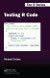
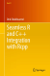
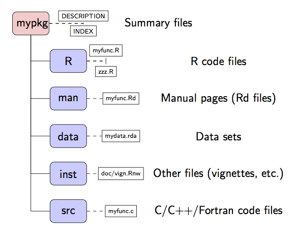

# Introduction

## Course outline

* Day 1

    * Introduction to `R` packages

    * Advanced documentation (Sweave and R markdown)

* Day 2

    * Advanced topics

    * Rcpp interface


## Why develop an R package?

* Keep all your `R` files organised.

* Keep all your functions documented.

* This also includes your datasets.

* Share your work with others... and your 'future self'.

* Excellent way to provide suplementary materials to papers.

* Actually, papers on `R` packages can be published in the 
*Journal of Statistical Software* and *R Journal*.


## Sources


* [R Development Core Team (2017). Writing R Extensions. Version 3.4.1.](https://cran.r-project.org/doc/manuals/r-release/R-exts.html)

*  [H. Wickham (2015). R packages. O'Reilly.](http://r-pkgs.had.co.nz)

*  [R. Cotton (2017). Testing R code. CRC Press.](https://www.crcpress.com/Testing-R-Code/Cotton/p/book/9781498763653)

*  [D. Eddelbuettel (2013). Seamless R and C++ Integration with Rcpp. Springer.](http://www.rcpp.org/book/)


## Required tools

* `C`/`Fortran`/`...` compilers

* LaTeX 

* Possibly, other external libraries: BLAS, LAPACK, MPI, etc.

* ...

## Required tools

**Windows**

Install R tools from:

 [https://cran.r-project.org/bin/windows/Rtools/](https://cran.r-project.org/bin/windows/Rtools/)

**Mac OS X**


Tools for building `R` on Mac OS X are available here:

[https://cran.r-project.org/bin/macosx/tools/](https://cran.r-project.org/bin/macosx/tools/)

**Linux**

Install the '-dev' version of `R` and associated packages.


# R packages

## Dissemination of results (with `R`)

* Dissemination of statistical research among non-statisticians (for example, social scientists)

* Dissemination involves

* Providing research in a way that it is usable (and understandable) to others

* Developing training materials

* Building bridges accross disciplines

* `R` packages are a suitable way of disseminating research

*  Non-specialised researchers (i.e., non-statisticians) can be targeted


## Why `R`? {.smaller}

* Freely available and Open Source software for statistical data analysis

* Easily expandable by means of its system of packages

* Links to several external software (BUGS, Gstat, XGobi, ...)

* Convenient way of disseminating software and documentation

* Ideal to develop additional materials in the form of packages

    *  R and C/C++/Fortran code can be included

    * Links to external libraries

    * High-quality manual pages and documentation

    * Data sets with examples

    * Tests can be added to automatically check the code


## References and other sources

* R Development Core Team (2008). Writing R Extensions. Version 2.7.0.

* W. N. Venables and B.D. Ripley (1999). Modern Applied Statistics with S-PLUS. Third Edition. Springer.

* W. N. Venables and B. D. Ripley (2000). S Programming. Springer.

* H. Wickham (2015). R packages. O'Reilly. 

* R. Cotton (2017). Testing R code. CRC Press.

* D. Eddelbuettel (2013). Seamless R and C++ Integration with Rcpp. Springer.


## What is in an R package?

* Package metadata: author, date, title, etc.

* Functions in `R` code

* Manual pages

* Datasets

* Vignettes and other documentation

* Tests

* Code in other languages

* ...


## Formats of an R package

* Source code

    * Raw files for editing.

* Bundle format (`tar.gz`)

    * Compressed source code.

    * Available from CRAN for all platforms.

* Binary format

    * Compiled code.

    * Avilable from CRAN for Windows and Mac OS X.


## Structure of an R package

Mind the `NAMESPACE`!




## `DESCRIPTION`  of a package

The `DESCRIPTION` file (under `mypkg/`) provides essential information about the package

```
Package: pkgname
Version: 0.5-1
Date: 2004-01-01
Title: My First Collection of Functions
Author: Joe Developer <Joe.Developer@some.domain.net>, with
  contributions from A. User <A.User@whereever.net>.
Maintainer: Joe Developer <Joe.Developer@some.domain.net>
Depends: R (>= 1.8.0), nlme
Suggests: MASS
Description: A short (one paragraph) description of what
  the package does and why it may be useful.
License: GPL (>= 2)
URL: http://www.r-project.org, http://www.another.url
```

## `NAMESPACE` of a package

The `NAMESPACE` file (under `mypkg/`) provides essential information about the package

* It defines what functions are *exported*, i.e., seen by other packages.

* Non-exported functions are internal to the package.

* It also defines what functions are *imported* from other packages, i.e.,
what functions from other packages are used in our package.

* It defines what shared libraries are loaded and what functions
in compiled code are available.


## Structure of the R function files {.smaller}

**Which files?**

`R` code (i.e., functions, etc.)

**Where are they located?**

`mypkg/R`

**A few suggestions on good maintenance:**

* Keep files of a reasonable size

* Include comments in the code (using # at the beginning on the line comment)

* Try to include related functions in the same file or in separated files if they are too long

* Think of a reasonable structure of the parameters to be passed and returned by the function. This is specially important to maintain the code in the long term.


## Documenting functions {.smaller}

**Which files?**

`R` manual pages (`.Rd` files)

**Where are they located?**

`mypkg/man`


*  `R` provides a suitable documentation format to produce manual pages

*  Documentation files must have the `.Rd` extension

*  The format of these files is similar to LATEX

*  Examples included in the manual pages can be run with the command `examples()`

*  Rd files can be converted into LATEX files and other formats


## Rd files structure (I) 

**Header**

```
\name{load}        #Main name to identify the manual page
\alias{load}       #Another names of documented objects
\title{Reload Saved Datasets}  #Title of the manual page
```


**Description**

```
#Main description of the function
\description{
  Reload the datasets written to a file with the function
  \code{save}.
}
```

## Rd files structure (II)

**Usage**

```
#How to call the function
#The arguments must be in the same order as in the definition
\usage{
load(file, envir = parent.frame())
}
```

**Arguments**

```
\arguments{
\item{file}{a connection or a character string giving the
  name of the file to load.}
\item{envir}{the environment where the data should be
  loaded.} }
```

## Rd files structure (III)

**Details**

```
\details{
#Details about the method, its implementation, etc.
}
```

**Value**

```
\value{
#Description of the values returned by the function.
#
#Usually, variables are described as in the 'arguments' section 
#using \item{variable}{description}
}
```


## Rd files structure (IV)


**See also**

```
\seealso{
  \code{\link{save}}.
}
```


**Examples**

```
\examples{
## save all data
save(list = ls(), file= "all.Rdata")
## restore the saved values to the current environment
load("all.Rdata")
## restore the saved values to the workspace
load("all.Rdata", .GlobalEnv)
}
```


## Rd files structure (V)

**References**

```
\references{
R Development Core Team (2007). R: A language and environment
for statistical computing. R Foundation for Statistical
Computing, Vienna, Austria.
ISBN 3-900051-07-0, URL http://www.R-project.org.
}
```


**Keywords**

A complete list of keywords is available in `R_HOME/doc/KEYWORDS` 

```
\keyword{file}
```


## Rd files structure (and VI)  {.smaller}

**How to format text**


*  Text formatting: `\emph{}`, `\code{}`, `\bold{}`, ...   

* Bullet points

```
\itemize{
\item Model 1
\item Model 2
\item Model 3
}
```

* Tables

```
\tabular{rlll}{
        \tab  MSE  \cr
Model 1 \tab  1.23 \cr
Model 2 \tab  2.23 \cr
Model 3 \tab  1.41
}
```


## Equations {.smaller}


*  `\eqn{latex}{ascii}` and `\deqn{latex}{ascii}` can be used to include in-line and displayed equations

*  `ascii` will be shown in the `R` manual pages

*  `latex` will be shown when producing a LATEX version of the
manual pages

*  If only one argument is passed it will be the value of `ascii`
and `latex`

* `\eqn{latex}{ascii}` is equivalent to the `$ ... $` environment

*  `\deqn{latex}{ascii}` is equivalent to the `$$ ... $$` (`\begin{equation} ... \end{equation}`) environment

**Example (Poisson probability function)**

```
\deqn{p(x) = \frac{\lambda^x e^{-\lambda}}{x!}}{%
      p(x) = lambda^x exp(-lambda)/x!}
```


## How to include data sets {.smaller}

**Which files?**


Data sets in several formats


**Where are they located?**

`mypkg/data`


* Usually, data are under the data directory

* Three formats are allowed:
  
    * Plain R code: `.R` or `.r` files

    * Tables: `.tab`, `.txt` or `.r` files

    * `save()` images: `.RData` or `.rda` files

* Other types of data (for example, maps) can be included in a specific directory under `inst`


## Documenting data sets

```
\name{rivers}
\docType{data}      #For Rd documenting data sets only
\alias{rivers}
\title{Lengths of Major North American Rivers}
\description{
  This data set gives the lengths (in miles) of 141
  \dQuote{major} rivers in North America, as compiled
  by the US Geological Survey.
}
\usage{rivers}  #NOTE that this is different now
\format{A vector containing 141 observations.}
\source{World Almanac and Book of Facts, 1975, page 406.}
\references{
  McNeil, D. R. (1977) \emph{Interactive Data Analysis}.
  New York: Wiley.
}
\keyword{datasets}
```

## Source code in `C`/`Fortran` {.smaller}

**Which files?**

Source code in `C`/`C++`/`Fortran`/...

**Where are they located?**


`mypkg/src`


* `R` provide an interface to link `R` and shared libraries.

* When the binary package is built or installed, the code is
compiled and a shared library is created

* This shared library is loaded in memory when the package is loaded

* Compilation flags and option can be set and other tools (such as `configure`) can be used, but we will NOT see this in this course.

* Links to other libraries can be created with this mechanism


## `C` Interface in `R`


`R` provides an interface to `C` by means of the following function

```
 .C(name, ..., NAOK = FALSE, DUP = TRUE, PACKAGE,
ENCODING)
```

* `name` is the name of the `C` function

*  `...` is replaced by the arguments passed to the `C` function

* `PACKAGE` is the name of the package

* All arguments are passed as pointers to data

* `.C` will return all arguments

* The results must be changed and stored in one the arguments passed to `.C`


## Example of a call to C code  {.smaller}

**`C` code**

```
void scprodc(double *v1, int *dim1, double *v2, int *dim2,
  double *results)
{
  results[0]=compute_norm(v1);
  results[1]=compute_norm(v2);
  results[2]=scalar_prod(v1, v2);
}
```

**`R` code**

```
scprod<-function(v1, v2)
{
  results<-c(0, 0, 0) #The results will be saved in this vector

  #Call  C function
  res<-.C("scprodc", as.numeric(v1), as.integer(length(v1)),
    as.numeric(v2), as.integer(length(v2)), as.numeric(results),
    PAKAGE="scprod")

  #Take the 5th returned value, i.e., results
  return(res[[5]])
}
```


## Loading a package with compiled code

* If compiled code is included, `R` will create a shared library when the package the binary package built or installed

* This shared library must be loaded together with the other `R` code

* In order to load compiled code, a line with `useDynLib(mypkg)` must be
included in the `NAMESPACE`.


## R CMD command 

*  `R` provides a command interface to manage packages

* `R CMD ...` is the Linux/Mac OS X command

* `Rcmd.exe ...` is the command in Windows

## R CMD command {.smaller}

* `R CMD check ...`

    Check the structure and contents of a package.

* `R CMD INSTALL ...`

    Install a package.

* `R CMD REMOVE ...`

    Remove a package.

*  `R CMD build ...`

    Build package for installation.

*  `R CMD SHLIB ...`

    Create shared library with the `C`/`Fortran`/`...` compiled code in the package.

* `R CMD Rd2pdf ...`

    Produce documentation in PDF and similar formats.


## How to build an R package {.smaller}

**Linux**


*  `R` packages for Linux are distributed as source code

*  To create a compressed file with the package contents (under `mypkg`) we will do

    `R CMD build mypkg`


**Windows**

*  Windows uses binary ZIP files instead

*  If `C`/`C++`/`Fortran`/`...` source code in included in the package
additional tools must be installed

*  See *Building R for Windows*:
       [http://www.murdoch-sutherland.com/Rtools/](http://www.murdoch-sutherland.com/Rtools/)

*  To create a package with compressed data and vignettes from the main package directory

    `R CMD build --resave-data --compact-vignettes mypkg`


## How to install an R package 

**Linux**


* Packages are compiled and installed from a source package

* Appropriate compilers need to be installed
  
* `R` packages can be installed in the user space

* `R CMD INSTALL -l mydir mypkg.tar.gz` will install `mypkg` under `mydir`


**Windows**

*  Binary files in a ZIP file are used and they are installed from the main graphical interface

* Compiled and stored on CRAN


## How to start? {.smaller}

1. Create a directory named as the package

2. Create the `DESCRIPTION` file

3. Create the main directories: `R`, `man` and, optionally, `src`

4. Add `R` code files to the `R` directory

5. For each function, add a manual page in the man directory

6. Create the `data` directory

7. Add data sets

8. For each data set, write a manual page

9. Add examples to the `R` functions manual pages using the included data sets

**Optionally**

  Add vignette files to the `vignettes` directory


## Creation of packages with `package.skeleton` {.smaller}

* `package.skeleton(name, list)` creates the basic directories and files from some `R` objects that are already in the current session

*  Main arguments

    * `name`

       Character string with the name of the package

    * `list`

       List of names of the `R` objects (functions and data) that will be included in the package.

```
## two functions and two "data sets" :
f <- function(x,y) x+y
g <- function(x,y) x-y
d <- data.frame(a=1, b=2)
e <- rnorm(1000)

package.skeleton(list=c("f","g","d","e"), name="mypkg")
```


## Including vignettes in the packages

* `R` manual pages provide a suitable documentation system within `R`

* However, it is very limited. Specially to deal with mathematics and formulae

* Vignettes can be included to fill this gap

* A vignette is intended to provide extended examples or data analysis on a particular issue

* Vignettes are particularly useful for dealing with topics that are difficult to document using `R` manual pages

* `Sweave` provides a way of mixing `R` code and `LaTeX` documents

* Non-`Sweave` vignettes can be included as well.


## Package management

**Package installation**

* CRAN (with `install.packages`).

* github (with `devtools::install_github`).

* Download source packages with `download.packages()`.


## Example: sumR

* Simple package with several functions to compute the sum of two numbers.

* `R` code.

* Manual pages using `Roxygen`.

* Calls to `C` code using `.C`, `.Call` and `Rcpp`.

* Vignettes using `Sweave` and `R` markdown.

* Tests, based on the `testthat` package.

## Package development with `devtools` {.smaller}

The `devtools` package provides a number of helper functions to create
packages:

1. (optional) Create an empty repository on github and clone it locally

2. `devtools::create(".")` on the cloned folder to create the basic files and directories.

3. Edit the `DESCRIPTION` file.

4. Add `R` files to `mypkg/R`.

5. `devtools::document()` to update manual pages and `NAMESPACE`.

6. Repeat these steps until all `R` files have been included and documented.

7. Run `devtools::check()`to check the package.

8. Fix errors and warnings, and `check`.

9. Run `devtools::install()` to install locally.

10. Run `devtools::build()` to create a bundle with the package files. This
is what you need to submit to CRAN.


## Some tips

* Use `.gitignore` to list files not be uploaded to github.

* Use `.Rbuildignore` to list files to be ignored when building the package
(e.g., compiled code and github files).

* When in doubt check how other developers have written their packages.


## Uploading a package to CRAN {.smaller}

**The time of the volunteers is CRAN’s most precious resource,...**

* Read [CRAN Repository Policy](https://cran.r-project.org/web/packages/policies.html)

*  BEFORE submitting a package to CRAN:

    * Make sure that it complies with CRAN policies.

    * Make sure that it passess all checks with the current or in development version of `R`.

    * If possible, test on an external machine (Travis CI) and on different
architectures.

    * Check the [R Hub builder](https://builder.r-hub.io).

    * For Windows, check the [Win Builder](https://win-builder.r-project.org).

