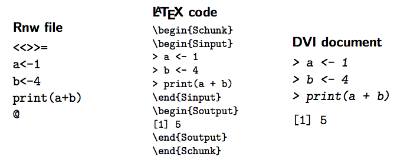
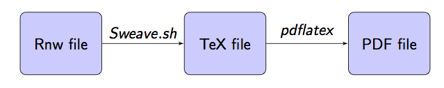

## Introduction

* In Lecture 1 we have already seen how manual pages are structured.

* However, manual pages can be difficult to maintain and get outdated.

* Manual pages are not appropriate to develop long or complex examples.

* `rdoxygen` is an `R` package that supports doxygen documentation in `R` files.

* `Sweave` is a way of creating documents that mix LaTeX and `R` code.

* `R` markdown is anoter convenient tool to develop documentation by mixing
a simple document structure and `R` code.

## Package documentation

* Manual pages

* Vignettes

* ...

# `rdoxygen`


## Introduction

* `rdoxygen` is a package that allows the use of doxygen documentation in `R`.

* A number of tags, and other information, in included in the `R` files.

* Manual pages (and, possibly, other files such as `NAMESPACE`) are created
or modified by running `devtools::document()`

## Example: `sumR` {.smaller}

```
#' @name sumR
#' @rdname sumR
#'
#' @title Addition of two numbers.
#'
#' @description This package contains several functions to compute the addition
#' of two numbers.
#'
#' @param x A number.
#' @param y A number.
#'
#' @return The addition of \code{x} and \code{y}.
#' 
#' @examples
#' sumR(1, 2)
#'
#' @export
sumR <- function(x, y) {
  return(x + y)
}
```


## Example: `sumR` {.smaller}

```
% Generated by roxygen2: do not edit by hand
% Please edit documentation in R/sumR.R
\name{sumR}
\alias{sumRC}
\title{Addition of two numbers}
\usage{
sumR(x, y)
}
\arguments{
\item{x}{A number.}

\item{y}{A number.}
}
\value{
The addition of \code{x} and \code{y}.
}
\description{
This package contains several functions to compute the addition
of two numbers.
}
\examples{
sumR(1, 2)
}
```


## Common `rdoxygen` tags


* `@name`, function name.

* `@rdname`, Rd file where the documnetation is merged so that a single Rd file is created from several functions.

* `@title`, title of the manual page.

* `@description`, a short description of the function.

* `@param`, description of a parameter passed to the function.

* `@return`, description of the value returned by the function.

* `@examples`, `R` code for the examples.

* `@export`, export function and add a line to the `NAMESPACE`.

* `@keywords`, `R` keywords.

# Vignettes

## What is a vignette?

* A vignette is, essentially, a document that describes the use of some
of the functions in a package.

* In principle, vignettes can be in any format (PDF, HTML, etc.).

* `R` provides a number of tools to make.

* Vignettes sources should be under `vignettes`.

* Compiled vignettes will be under `inst/doc` after they are processed.

* Complete details about vignettes can be found in 'Writing R extensions' here:

[https://cran.r-project.org/doc/manuals/r-release/R-exts.html#Writing-package-vignettes](https://cran.r-project.org/doc/manuals/r-release/R-exts.html#Writing-package-vignettes)


## Formats of R vignettes {.smaller}


* `Sweave`

    * This is the default.

    * `Sweave` is based on `LaTeX` and it can include `R` code chunks.

    * `R` code is run and replaced by its ouput in the final `.tex` file.

    * Output in PDF format.


* `Non-Sweave` 

    * `R` can have vignettes in other formats than `Sweave`.

    * Other vignette builders need to be stated in the `DESCRIPTION`:

             `VignetteBuilder: knitr`

    * Output can be HTML, PDF and possibly other formats.

    * `devtools::use_vignette("file.Rmd")` can help to set the options required to build the vignette.


# Sweave

## What is Sweave?

* Created by Friedrich Leisch (member of R Core Team)
* Main site:

  [http://www.ci.tuwien.ac.at/~leisch/Sweave/](http://www.ci.tuwien.ac.at/~leisch/Sweave/)

* Sweave provides a way of interfacing R code with LATEX documents

* A version for Open Document Format (ODF) documents (for OpenOffice V 2.0 and later) is available in package `odfWeave`


## Basics of Sweave and literate programming

*  **Literate programming** *is a philosophy of computer programming based on the premise that a computer program should be written similar to literature, with human readability as a primary goal.* (Wikipedia, 14 Nov. 2007)

*  Sweave is based on Cweb, developed by Donald Knuth for the C programming language

*  The aim is to provide high quality documentation by mixing text and programming code

*  There are two main tools to handle these documents:
 
    * Sweave

      Produces suitable documentation from the main source files

    * Stangle

      Produces programming code from the main source files

## Building a `Rnw` document

* Main structure is that of a LATEX document

* LATEX package Sweave must be included in the list odf
packages loaded
  
* `R` code can be included as follows:




## Processing Rnw files



* A script (*Sweave.sh*) can be used to Sweave documents from
the command line:

```
#!/bin/sh
echo "library(\"utils\"); Sweave(\"$1\")" | R --no-save --no-restore
```

*  Sweave can be used as `./Sweave.sh mydocument.Rnw`


## Extracting the code from the chunks

* Stangle provides a way of extracting the code in the chunks

* `Stangle("myfile.Rnw")` will create a file called `myfile.R` with
the R chunks

* Each chunk is identified with a number using `R` comments

* Useful to identify possible problems when compiling the Rnw file

* A script (`Stangle.sh`) can be used to Stangle documents from
the command line:

```
#!/bin/sh
echo "library(\"utils\"); Stangle(\"$1\")" | R --no-save --no-restore
```

* `Stangle` can be used as *./Stangle.sh mydocument.Rnw*


## Chunk 

Several options can be placed in `<< >>=` to control how the code in the chunks is executed.

* `eval` (**TRUE**, FALSE)

  Whether the R chunk is run.

* `echo` (**TRUE**, FALSE)

  Whether the R chunk is shown in the LATEX file.

* `results` (**verbatim**, tex, hide)

Type of output used to show the printed results produced by the R code. ’hide’ will show no output at all.


## In-line chunks

* `\Sexpr{Rcode}` allows for a limited *in-line* computation and output


*  **Rnw code**

`$e^{2\pi}$ equals \Sexpr{formatC(exp(2*pi), 5)}`

*  **LATEX code**

`$e^{2\pi}$ equals 535.49`

*  **DVI file**

$e^{2\pi}$` equals 535.49`


## Plots in Sweave  {.smaller}

**Chunk options**


*  `fig`  (**FALSE**, TRUE)

  Whether the output is a figure. By default, EPS and PDF files are produced.
  
* `width`

  Width of the plot

* `height`

  Height of the plot


**Hints**

* The Sweave code can be included within a LATEX figure environment

* `Trellis` graphics must be wrapped within a print call:

```
print(xyplot(y ~ x, data=d))
```


## Some issues on creating Vignettes


* `R` vignettes are usually developed using Sweave (the default).

* They are placed under `pkg_name/vignettes`.

* A vignette index entry must be included in the header of the Rnw file.

  `\VignetteIndexEntry{sumR Example}`

*  When `R CMD check` is run on the package source, the `R` chunks in the vignette are also tested.


##  Resources

* Sweave main page 

  [http://www.ci.tuwien.ac.at/~leisch/Sweave/](http://www.ci.tuwien.ac.at/~leisch/Sweave/)

* Charlie Geyer’s demo 

  [http://www.stat.umn.edu/~charlie/Sweave/](http://www.ci.tuwien.ac.at/~leisch/Sweave/)

* Literate programming (D. Knuth’s web site) 

  [http://www-cs-faculty.stanford.edu/~knuth/lp.html](http://www-cs-faculty.stanford.edu/~knuth/lp.html)

*  Literate Programming 

  [http://www.literateprogramming.com](http://www.literateprogramming.com)


# R markdown

## What is R markdown?

* Markdown is a simple 'lightweight markup language' to create documents.

* R markdown is an implementation of markdown that allows `R` code 
to be embeded.

* R markdown files often use the .Rmd extension.

* R markdown has been developed by RStudio: [http://rmarkdown.rstudio.com](http://rmarkdown.rstudio.com)


## Why use R markdown?

* Simple way of creating documents.

* Fully reproducible examples.

* Supports a number of output formats: LaTeX, HTML, etc.

* Supports other languages, in addition to `R`.

* Available in package `markdown`.

* These slides have been created with R markdown!

* A cheatsheet is available here: [https://www.rstudio.com/resources/cheatsheets/](https://www.rstudio.com/resources/cheatsheets/)

## Rmd document structure

* **Header**, with metadata.

    * Title

    * Author

    * Date

    * Output format

* **Body**, with main contents.

    * Sections

    * Subsections

    * `R` code 

## Rmd document header


```
---
title: "Practical 1: Introduction to R packages"
author: "Virgilio Gómez-Rubio"
date: ""
output: pdf_document
---
```

* Use UTF-8 encoding (if possible)

* Check the vignette in the `sumR` for a simple example

* Complete details are availabe here:

[http://rmarkdown.rstudio.com/lesson-1.html](http://rmarkdown.rstudio.com/lesson-1.html)

## Example: `R` markdown document

* Check the source code of *Practical 1* in file `practicals/practical1.Rmd`.

* Also, check the cheatsheet to get an idea of the main tags in `R` markdown.

* Vignettes can be compiled with `knitr::knit` during development to
avoid checking the whole package.

* Also, with `devtools::build_vignettes`.


